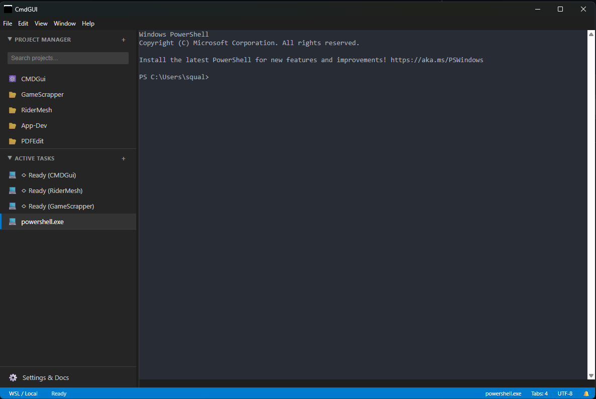
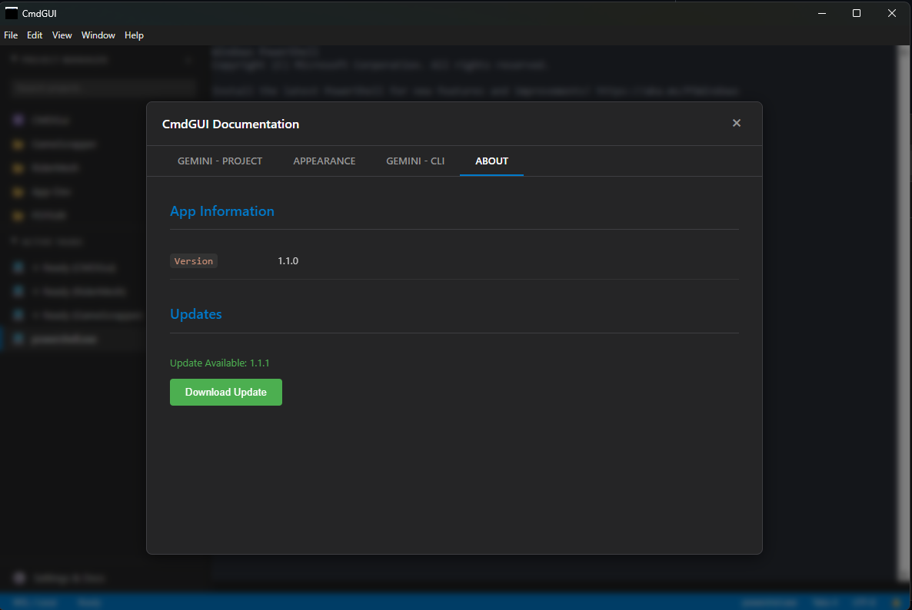

# CmdGUI

<a href="https://ko-fi.com/B0B21RXKG4"></a>

**CmdGUI** is a developer-focused workspace manager designed to streamline your command-line workflow. Built with **Tauri**, **React**, **Rust**, and **TypeScript**, it serves as a central hub for all your active projects, allowing you to manage multiple terminal sessions (PowerShell/Bash) with a persistent state that remembers your setup between launches.

## 📸 Gallery

|              Main Interface              |           Settings & Appearance            |
| :--------------------------------------: | :----------------------------------------: |
|  |  |

## Key Features

- **🖥️ Integrated Terminal Environment:** Full-featured terminal emulation using `xterm.js` and `node-pty`.
- **📂 Project Manager:** Easily add, remove, and switch between project directories from a collapsible sidebar.
- **🏷️ Smart Detection:** Automatically identifies and assigns icons to project types (React, Vue, Angular, Svelte, Node.js, Python, Rust, Go, Docker, .NET, C++, and Git).
- **📑 Multi-Tab Interface:** Run independent terminal sessions with **Tab Hibernation** (memory-saving) to support dozens of concurrent tasks.
- **⚡ GPU-Accelerated Rendering:** High-performance WebGL rendering pipeline for buttery-smooth terminal output.
- **💾 Persistent State:** Your open tabs, sidebar width, and added projects are saved automatically with **Automatic Session Recovery**.
- **🛡️ Admin Mode:** Built-in support for relaunching with elevated privileges for administrative tasks.

<details>
<summary><strong>FAQ: How is this different from Windows Terminal?</strong></summary>

### Core Philosophy

- **CmdGUI (Project-Centric):** Acts as a **Workspace Manager**. It organizes your workflow around specific _projects_ (e.g., "Client App", "Backend API") rather than just shells. It's like the "Terminal" panel of VS Code, but detached and persistent.
- **Windows Terminal (Shell-Centric):** A host for running command-line shells. It organizes workflow around _environments_ (PowerShell, Ubuntu) rather than folder contexts.

### User Interface

- **CmdGUI:** Features a persistent **Sidebar** with a "Project Manager". You actively "add" folders, and the app uses **Smart Detection** to assign icons based on the tech stack (React, Python, etc.).
- **Windows Terminal:** Relies on tabs and profiles. To open a project, you typically navigate manually or configure a static profile.

### Workflow & Persistence

- **CmdGUI:** **State Persistence** is key. It remembers exactly which project tabs were open and your sidebar state between launches. Terminals are spawned _from_ projects.
- **Windows Terminal:** Sessions are generally ephemeral. While it can restore tabs, it's primarily designed for fresh sessions or static startup configurations.

### Summary

**CmdGUI** is an **"IDE without the Code Editor"**—perfect for developers juggling multiple repositories who want a preserved "Command Center."
**Windows Terminal** is the **"Standard Bearer"**—the raw, high-performance engine for running shells, regardless of context.

</details>

## Tech Stack

- **Frontend:** React 19, Vite, TypeScript, react-window
- **Backend:** Tauri, Rust, portable-pty
- **Terminal:** xterm.js, WebGL/Canvas Rendering, xterm-addon-serialize

## Getting Started

### Prerequisites

- Node.js (v18 or higher recommended)
- npm
- Rust (stable toolchain)

### Installation

1.  Clone the repository.
2.  Install dependencies:

    ```bash
    npm install
    ```

### Development

To run the application in development mode (React dev server + Tauri):

```bash
npm run dev
```

### Building

To build the application for production (creates a Tauri installer/executable):

```bash
npm run dist
```

## Available Commands

The application provides a "Settings & Docs" modal that features a tabbed interface:

- **GEMINI - Project:** Documentation for CmdGUI application shortcuts and interface navigation.
- **GEMINI - CLI:** A comprehensive list of Gemini CLI slash commands and Windows PowerShell ISE keyboard shortcuts.

## License

ISC
